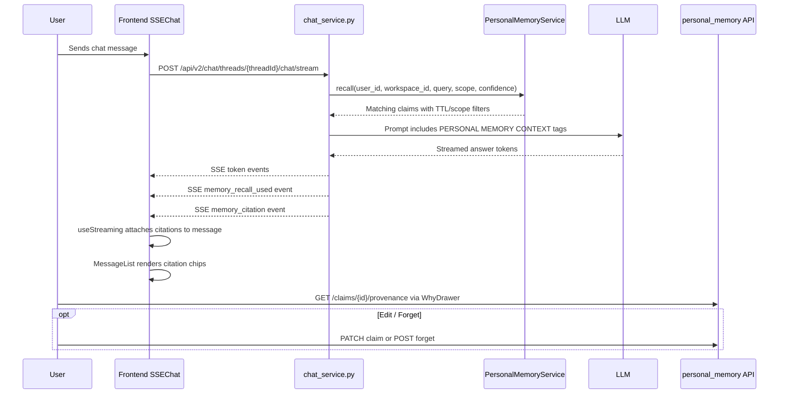

# T33 Inline Memory Citations in Chat — Plan Only

## 1. Executive Summary

> **Goal**: Add inline memory citations to Flowmanner chat by reusing the shipped T32 Memory Inspector system, without adding backend tables or new HTTP routes.
>
> **Approach**: Backend chat streaming recalls relevant personal-memory claims, emits citation metadata over SSE, and the frontend renders per-message citation chips. Users can inspect provenance with `WhyDrawer` and, in later rollout stages, edit/forget cited claims from the message menu.
>
> **Important path note**: Glenn requested `/home/glenn/FlowmannerV2-frontend/plans/memory-citations-t33-plan.md`, but planner constraints allow plan output only under `.sisyphus/plans/`. This plan is therefore saved at:
> `.sisyphus/plans/memory-citations-t33-plan.md`

### Locked Scope

- Reuse T32 Memory Inspector components: `WhyDrawer`, `EditClaimDialog`, `ForgetConfirmDialog`, `ConfidenceBar`.
- Add citations to chat only; do not rebuild the Memory Inspector.
- No new backend tables.
- No new backend HTTP routes beyond existing recall, provenance, edit, and forget flows.
- No new dependencies.
- Staged rollout is `0 → 1 → 2 → 3` behind feature flags.
- Memory is per-user + workspace only; no cross-tenant leakage.
- Citations have TTL and must never be stored “forever.”
- English copy goes in `en.json` only; `de`, `es`, `fr`, and `ja` fall back to `en`.

### Recommended MVP

- **T33 MVP**: pre-LLM memory recall + backend SSE citation events + frontend citation chips + `WhyDrawer`.
- **T33.1**: per-message `Edit` and `Forget this`.
- **T33.2**: stronger citation matching and safer UX.
- **T34**: richer memory lifecycle and post-LLM extraction if needed.

---

## 2. Architecture Diagram

### End-to-End Flow

```text
User message
  ↓
Frontend SSEChat.tsx
  ↓
POST /api/v2/chat/threads/{threadId}/chat/stream
  ↓
backend/app/services/chat_service.py
  ↓
PersonalMemoryService.recall(user_id, workspace_id, query, scope, confidence)
  ↓
Pre-LLM prompt injection:
  PERSONAL MEMORY CONTEXT
  - [memory: c-550e8400, conf 0.85] subject → predicate → object
  ↓
LLM streams tokens
  ↓
chat_service.py emits:
  - token
  - memory_recall_used
  - memory_citation
  - complete
  ↓
useStreaming.ts stores citation metadata on message
  ↓
MessageList.tsx renders assistant message + citation chips
  ↓
User clicks chip/menu
  ↓
WhyDrawer fetches:
  GET /api/v2/personal_memory/claims/{claimId}/provenance
  ↓
Optional:
  PATCH /api/v2/personal_memory/claims/{claimId}
  POST /api/v2/personal_memory/forget
```

### Mermaid Diagram



### Critical Design Principle

The chat UI should not parse memory citations out of raw LLM text for the MVP. The backend should emit structured citation metadata over SSE. Frontend rendering should consume metadata. This avoids brittle regex parsing, code-block false positives, and locale-dependent formatting.

---

## 3. Backend Diff Intent

### Primary Backend File

- `/opt/flowmanner/backend/app/services/chat_service.py`

### Add Without New Tables

Add a small memory citation path around the existing chat streaming flow:

1. Before calling the LLM, recall relevant memory claims using existing `PersonalMemoryService.recall`.
2. Inject a bounded memory context block into the prompt.
3. Emit `memory_recall_used` SSE events for claims that are actually supplied to the model.
4. Emit `memory_citation` SSE events for claims that should be rendered as chat citations.
5. Preserve existing `complete` behavior even if memory recall fails.

### Possible New Service Class

Create only if needed for readability:

- `/opt/flowmanner/backend/app/services/memory_citation_service.py`

This would wrap:

- recall call
- scope filtering
- citation metadata formatting
- SSE event emission helpers

It should not own persistence and must not call `db.commit()`.

### Backend Constraints

- No new tables.
- No new HTTP routes beyond existing:
  - `POST /api/v2/personal_memory/recall`
  - `GET /api/v2/personal_memory/claims/{id}/provenance`
  - `PATCH /api/v2/personal_memory/claims/{id}`
  - `POST /api/v2/personal_memory/forget`
- No `db.commit()` in services.
- No f-strings in `logger.()` calls.
- All new Python files must include `from __future__ import annotations`.
- Do not swallow recall failures silently. Log them and continue chat.

### Backend Diff Intent for `chat_service.py`

```text
stream_message_to_llm(...)
  existing setup
  memory_context = recall_relevant_memory(...)
  prompt_sections = existing sections + memory_context
  for event in llm_stream:
    yield token events
    if memory citations are associated with this response:
      yield memory_recall_used
      yield memory_citation
  yield complete
```

### Backend Diff Intent for Prompt Injection

Use the same style as `/opt/flowmanner/backend/app/services/mission_planner.py`:

```text
PERSONAL MEMORY CONTEXT
Use only if relevant. Do not claim facts from memory unless the answer clearly uses them.
- [memory: c-550e8400, conf 0.85] subject → predicate → object
```

The exact prompt text should be reviewed by Glenn because it affects model behavior.

---

## 4. SSE Event Schemas

### Existing SSE Event Types

The chat stream already handles:

- `token`
- `complete`
- `error`
- `tool_call_start`
- `tool_call_result`
- `sandbox.*`

### New SSE Event Type: `memory_recall_used`

Purpose: tell the frontend which recalled claims were supplied to the model.

```ts
type MemoryRecallUsedEvent = {
  type: "memory_recall_used";
  message_id: string;
  claim_id: string;
  citation_id?: string;
  match_kind?: "substring" | "semantic";
  source: "pre_llm_context" | "post_llm_extraction";
  scope: "personal" | "workspace" | "program";
  confidence?: number;
  ttl_ms?: number;
};
```

### New SSE Event Type: `memory_citation`

Purpose: tell the frontend which citation chips to render for a message.

```ts
type MemoryCitationEvent = {
  type: "memory_citation";
  message_id: string;
  citation_id: string;
  claim_id: string;
  label: string;
  subject?: string;
  predicate?: string;
  object?: string;
  confidence?: number;
  scope: "personal" | "workspace" | "program";
  token_start?: number;
  token_end?: number;
  created_at?: string;
  expires_at?: string | null;
};
```

### Optional Event Type: `memory_recall_error`

Recommended for robustness, but optional if the existing `error` event already carries enough detail.

```ts
type MemoryRecallErrorEvent = {
  type: "memory_recall_error";
  message_id: string;
  code: "memory_recall_failed" | "memory_recall_timeout" | "memory_scope_denied";
  user_visible?: boolean;
};
```

### Frontend Type Location

Add these types to:

- `/home/glenn/FlowmannerV2-frontend/src/lib/chat-types.ts`

### SSE Switch Location

Update the SSE event switch in:

- `/home/glenn/FlowmannerV2-frontend/src/hooks/useStreaming.ts`

---

## 5. Frontend File-by-File Change Plan

### A. Shared Chat Types

File:

- `/home/glenn/FlowmannerV2-frontend/src/lib/chat-types.ts`

Change intent:

- Add memory SSE event types.
- Add citation fields to chat message types.
- Avoid `any`; use explicit typed boundaries for SSE payloads.

Acceptance:

- TypeScript strict mode passes.
- No untyped `any` is introduced unless isolated behind a typed parser boundary.

### B. Streaming Hook

File:

- `/home/glenn/FlowmannerV2-frontend/src/hooks/useStreaming.ts`

Change intent:

- Handle `memory_recall_used`.
- Handle `memory_citation`.
- Attach citations to the correct assistant message by `message_id`.
- Preserve existing streaming behavior.
- Ensure `complete` still finalizes the message if memory recall fails.

Acceptance:

- Existing chat tests still pass.
- New tests prove citations are attached during streaming.
- New tests prove chat still completes when recall fails.

### C. Message Rendering

File:

- `/home/glenn/FlowmannerV2-frontend/src/components/chat/MessageList.tsx`

Change intent:

- Render citation chips after assistant message content.
- Do not render chips for user messages.
- Do not render chips when feature flag is off.
- Do not render chips for citations inside code blocks by relying on backend metadata, not raw text parsing.

Acceptance:

- Message rendering remains unchanged when no citations exist.
- Citation chips render only for assistant messages with citation metadata.

### D. New Citation Chip Component

Recommended path:

- `/home/glenn/FlowmannerV2-frontend/src/components/chat/memory-citations/MemoryCitationChip.tsx`

Purpose:

- Render `[memory: c-550e8400, conf 0.85]`.
- Use `ConfidenceBar` from T32 for confidence visualization.
- Open `WhyDrawer` or a local citation popover on click.

Acceptance:

- Renders exact MVP label.
- Keyboard accessible.
- Shows confidence safely.

### E. New Per-Message Memory Menu

Recommended path:

- `/home/glenn/FlowmannerV2-frontend/src/components/chat/memory-citations/MessageMemoryMenu.tsx`

Purpose:

- Progressive disclosure for `Why`, `Edit`, and `Forget this`.
- Wrap T32 components instead of rebuilding dialogs.
- Support later rollout stages.

Acceptance:

- Menu appears per assistant message with citations.
- `Why` opens `WhyDrawer`.
- `Edit` opens `EditClaimDialog`.
- `Forget this` opens `ForgetConfirmDialog`.

### F. New Hook for Message-Level Memory Actions

Recommended path:

- `/home/glenn/FlowmannerV2-frontend/src/hooks/use-message-memory-actions.ts`

Purpose:

- Centralize opening/closing memory drawers and dialogs.
- Pass `key={claim.id}` to known T32 dialogs to avoid stale reopen state.
- Avoid duplicating T32 hook logic.

Acceptance:

- Uses existing `use-personal-memory.ts` hooks.
- No duplicate API calls.
- Dialog state resets reliably between opens.

### G. Existing T32 API Client

File:

- `/home/glenn/FlowmannerV2-frontend/src/lib/api/personal-memory.ts`

Change intent:

- Prefer reuse of existing API functions.
- Only add a tiny helper if the current API client cannot return the exact fields needed by chat citations.

Acceptance:

- No duplicated fetch logic.
- Existing Memory Inspector API behavior remains unchanged.

### H. Existing T32 Hooks

File:

- `/home/glenn/FlowmannerV2-frontend/src/hooks/use-personal-memory.ts`

Change intent:

- Prefer reuse of existing hooks:
  - `useInspector`
  - `useClaimProvenance`
  - `useUpdateClaim`
  - `useForgetClaim`
  - `useHardForgetClaim`
- Add a chat-specific wrapper only if needed.

Acceptance:

- Memory Inspector behavior remains unchanged.
- Chat uses the same provenance/edit/forget APIs.

### I. Chat Composition Root

File:

- `/home/glenn/FlowmannerV2-frontend/src/components/chat/SSEChat.tsx`

Change intent:

- Ensure feature flags are available to `useStreaming` and `MessageList`.
- Do not move chat architecture.
- Keep existing SSE lifecycle intact.

Acceptance:

- Existing SSE chat tests still pass.
- Feature flag off path disables memory citations without breaking chat.

### J. Locale File

File:

- `/home/glenn/FlowmannerV2-frontend/src/i18n/locales/en.json`

Change intent:

- Add English copy only under:
  - `memory.citations.*`
  - `memory.actions.*`
- Do not edit `de.json`, `es.json`, `fr.json`, or `ja.json`.
- Preserve any pre-existing uncommitted locale work.

Acceptance:

- No French text appears in `en.json`.
- JSON remains valid.
- Other locales continue to fall back to `en`.

---

## 6. T32 Component Reuse Map

### Components to Reuse

| T32 Component | Reuse in T33 | Notes |
|---|---|---|
| `WhyDrawer` | Citation provenance drawer | Open from citation chip or message memory menu. |
| `EditClaimDialog` | Edit cited claim | Wrap in message-level menu. |
| `ForgetConfirmDialog` | Forget cited claim | Wrap in message-level menu. |
| `ConfidenceBar` | Citation confidence display | Render inside `MemoryCitationChip`. |

### Import Strategy

Use imports from:

- `/home/glenn/FlowmannerV2-frontend/src/components/memory-inspector/WhyDrawer`
- `/home/glenn/FlowmannerV2-frontend/src/components/memory-inspector/EditClaimDialog`
- `/home/glenn/FlowmannerV2-frontend/src/components/memory-inspector/ForgetConfirmDialog`
- `/home/glenn/FlowmannerV2-frontend/src/components/memory-inspector/ConfidenceBar`

### Known T32 Limitation

T32 handoff notes that edit/forget dialogs may not reset state on reopen. For T33, pass:

```text
key={claim.id}
```

to the wrapped T32 dialog components when needed.

### Reuse Guardrail

Do not rebuild:

- provenance drawer UI
- edit claim dialog UI
- forget confirmation UI
- confidence bar UI

Only wrap and adapt them for chat context.

---

## 7. Citation Matching Pseudocode

### Recommended Default

Use pre-LLM memory injection as the primary path. Post-LLM extraction should be a fallback only if Glenn chooses it.

### Pre-LLM Recall Pseudocode

```text
function buildMemoryContext(userMessage, user, workspace):
  query = normalize(userMessage)
  claims = PersonalMemoryService.recall(
    user_id = user.id,
    workspace_id = workspace.id,
    query = query,
    scope = ["personal", "workspace", "program"],
    confidence_min = 0.7,
    active_only = true,
    not_expired = true
  )

  filtered = claims where:
    claim.deleted_at is null
    claim.expires_at is null or claim.expires_at > now
    claim.tenant/user/workspace matches current request
    claim not sensitive/restricted

  return top_k(filtered, limit = 5)
```

### Citation Emission Pseudocode

```text
for claim in injected_claims:
  emit memory_recall_used(
    message_id,
    claim_id,
    match_kind = "substring",
    confidence = claim.confidence,
    source = "pre_llm_context",
    scope = claim.scope,
    ttl_ms = remaining_ttl_ms(claim)
  )

  emit memory_citation(
    message_id,
    citation_id = claim.id,
    claim_id = claim.id,
    label = formatCitation(claim),
    confidence = claim.confidence,
    scope = claim.scope,
    expires_at = claim.expires_at
  )
```

### Citation Label Format

Locked T33 format:

```text
[memory: c-550e8400, conf 0.85]
```

T33 omits mission/source because `PersonalMemoryClaim` has no mission number column and `source_id` is a UUID, not a sequential mission number.

```text
[memory: c-550e8400, conf 0.85]
```

### Matching Decision Clarified

The plan recommends:

- Use existing recall path first.
- Use `PersonalMemoryService.recall()` substring matching plus confidence `>= 0.7`; real semantic similarity is deferred to T33.1/T20.
- Exclude `private`, sensitive, restricted, expired, and deleted claims.
- Limit to top 5 claims to avoid prompt pollution.

---

## 8. UX Mockup

### MVP Interaction Model

Recommended: per-message 3-dot menu on hover.

```text
Assistant message:
  We should build the chat page with Next.js App Router,
  because it matches the existing frontend architecture.

  [memory: c-550e8400, conf 0.85]

  [⋯]  ← hover/click menu
       Why
       Edit
       Forget this
```

### Citation Chip UX

```text
[memory: c-550e8400, conf 0.85]
```

Click behavior:

- Primary click opens `WhyDrawer`.
- Long-term alternative: chip opens a small popover with `Why`, `Edit`, `Forget this`.

### Per-Message Menu UX

Menu actions:

1. **Why**
   - Opens `WhyDrawer`.
   - Fetches provenance from `GET /api/v2/personal_memory/claims/{claimId}/provenance`.

2. **Edit**
   - Opens `EditClaimDialog`.
   - Edits only the cited claim.

3. **Forget this**
   - Opens `ForgetConfirmDialog`.
   - Forgets only the cited claim for T33 MVP.

### UX Guardrails

- No global memory controls inside chat.
- No citation chrome for user messages.
- No visible memory UI when feature flag is off.
- No citation rendering from code blocks.
- No cross-workspace or cross-user memory display.

---

## 9. i18n Key Paths

### File

- `/home/glenn/FlowmannerV2-frontend/src/i18n/locales/en.json`

### Add Under `memory.citations`

Suggested keys:

```text
memory.citations.label
memory.citations.why
memory.citations.edit
memory.citations.forgetThis
memory.citations.provenanceTitle
memory.citations.noProvenance
memory.citations.expired
memory.citations.scope
```

### Add Under `memory.actions`

Suggested keys:

```text
memory.actions.why
memory.actions.edit
memory.actions.forgetThis
memory.actions.forgetConfirmTitle
memory.actions.forgetConfirmDescription
memory.actions.editTitle
```

### Suggested English Copy

```text
memory.citations.label: "Memory citation"
memory.citations.why: "Why this?"
memory.citations.edit: "Edit memory"
memory.citations.forgetThis: "Forget this"
memory.citations.provenanceTitle: "Why this memory?"
memory.citations.noProvenance: "No provenance available."
memory.citations.expired: "This memory has expired."
memory.citations.scope: "Scope"

memory.actions.why: "Why"
memory.actions.edit: "Edit"
memory.actions.forgetThis: "Forget this"
memory.actions.forgetConfirmTitle: "Forget this memory?"
memory.actions.forgetConfirmDescription: "This will forget only the cited claim, not the entire conversation."
memory.actions.editTitle: "Edit memory"
```

### i18n Guardrails

- Add to `en.json` only.
- Do not add French text to `en.json`.
- Preserve uncommitted changes in other locale files.
- Other locales continue to fall back to English.

---

## 10. Test Plan

### Unit Tests — Frontend

#### `chat-types.ts`

- Compile-time test via TypeScript strict mode.
- Ensure memory SSE event types are exported.

#### `useStreaming.ts`

Scenarios:

1. `memory_citation` event attaches citation to matching assistant message.
2. `memory_recall_used` event attaches recall metadata.
3. Citation events before `complete` are preserved.
4. Citation recall error does not prevent `complete`.
5. Feature flag off ignores citation events.

#### `MessageList.tsx`

Scenarios:

1. Assistant message with citation renders one citation chip.
2. User message with citation metadata does not render citation chip.
3. Message without citation metadata renders unchanged.
4. Multiple citations render in stable order.
5. Expired citation metadata is visually marked or hidden according to rollout stage.

#### `MemoryCitationChip.tsx`

Scenarios:

1. Renders `[memory: c-550e8400, conf 0.85]`.
2. Shows confidence with `ConfidenceBar`.
3. Keyboard activation opens `WhyDrawer`.
4. Missing mission number degrades to `[memory: c-550e8400, conf 0.85]`.

#### `MessageMemoryMenu.tsx`

Scenarios:

1. Menu opens per message.
2. `Why` opens `WhyDrawer`.
3. `Edit` opens `EditClaimDialog`.
4. `Forget this` opens `ForgetConfirmDialog`.
5. Dialogs receive `key={claim.id}` or equivalent reset behavior.

### Component Tests — Existing Locations

Use existing patterns from:

- `/home/glenn/FlowmannerV2-frontend/src/components/chat/__tests__/SSEChat.test.tsx`
- `/home/glenn/FlowmannerV2-frontend/src/components/memory-inspector/__tests__/MemoryInspector.test.tsx`

### Backend Tests

Location:

- `/opt/flowmanner/backend/tests/` or nearest existing test package.

Scenarios:

1. `chat_service.py` emits `memory_citation` when recall returns a matching claim.
2. `chat_service.py` emits `memory_recall_used` for injected claims.
3. Chat stream still yields `complete` when recall fails.
4. Expired claims are not recalled.
5. Deleted claims are not recalled.
6. Cross-workspace claims are not recalled.
7. Sensitive/restricted claims are not recalled.
8. No more than top 5 claims are injected.

### API Live Verification

Before claiming the API is live, run an actual host-level curl against:

```text
POST /api/v2/personal_memory/recall
```

Do not verify only in container.

### Playwright E2E

Required scenario:

1. Seed claim `c-550e8400` with subject like `Flowmanner uses Next.js App Router`, confidence `0.85`, scope `workspace`, and a short TTL.
2. Open chat.
3. Send prompt: `How should we build the chat page?`
4. Expect assistant answer to include a matching sentence.
5. Expect citation chip:

```text
[memory: c-550e8400, conf 0.85]
```

6. Click citation chip.
7. Expect `WhyDrawer` to open.
8. Expect provenance fetch to call:

```text
GET /api/v2/personal_memory/claims/c-550e8400/provenance
```

### Negative E2E Scenarios

- Feature flag off: no citation chip, chat still works.
- Recall endpoint returns 500: chat still reaches `complete`.
- Cross-workspace claim exists: no citation chip.
- Expired/deleted claim exists: no citation chip.
- Matching text appears inside a code block: no citation chip.
- Citation recall returns no matches: no citation chip, chat still works.

---

## 11. Phased Rollout

### Stage 0 — Disabled

- Memory recall is not invoked.
- No citation chips render.
- Existing chat behavior is unchanged.

Acceptance:

- Feature flag off path passes all existing chat tests.

### Stage 1 — Backend Recall Only

- Backend recalls memory and injects context.
- Backend emits `memory_recall_used` events.
- Frontend stores metadata but does not render chips.

Acceptance:

- Chat still works if recall fails.
- No visible UX changes.

### Stage 2 — Citation Chips + Why

- Backend emits `memory_citation`.
- Frontend renders citation chips.
- Clicking chip opens `WhyDrawer`.

Acceptance:

- Required Playwright scenario passes.
- No citation rendering for code blocks.
- No cross-tenant leakage.

### Stage 3 — Per-Message Memory Actions

- Per-message 3-dot menu appears for messages with citations.
- `Edit` and `Forget this` are enabled.
- T32 dialogs are reused.

Acceptance:

- Edit affects only cited claim.
- Forget affects only cited claim.
- Dialogs reset reliably on reopen.

### T33.1 — Safer Matching

- Tune recall threshold.
- Add negative tests for false positives.
- Possibly add scope-specific weighting.

### T33.2 — Better UX

- Improve chip placement.
- Add keyboard shortcuts if useful.
- Add empty-state messaging for expired citations.

### T34 — Post-LLM Extraction or Richer Memory Lifecycle

Only after Glenn approves the open decisions and T33 is stable.

---

## 12. Lessons from T32

### Reuse T32 Instead of Rebuilding

T32 already shipped:

- Memory Inspector page
- 8 components
- API client
- SWR hooks
- Provenance drawer
- Edit dialog
- Forget dialog
- Confidence bar

T33 should wrap and adapt these, not duplicate them.

### Reuse Existing API Client

Existing file:

- `/home/glenn/FlowmannerV2-frontend/src/lib/api/personal-memory.ts`

Existing hooks:

- `/home/glenn/FlowmannerV2-frontend/src/hooks/use-personal-memory.ts`

Do not create parallel fetch implementations unless absolutely necessary.

### Known T32 Limitation

Edit/forget dialogs may not reset state on reopen. T33 should avoid this by passing a stable `key={claim.id}` to wrapped dialogs.

### T32 Shipped State

- T32 shipped to `origin/master`.
- Commit: `fe9806a`.
- Memory Inspector page:

```text
/[locale]/memory-inspector
```

### T32 Lesson Applied

Chat citations should be metadata-driven, not text-parsing-driven. This avoids brittle regex, code-block false positives, and localization issues.

---

## 13. Open Decisions for Glenn

> **DECISIONS LOCKED 2026-06-14 (Glenn approved all 5 Sisyphus recommendations).**
>
> 1. Citation trigger: **C — hybrid (pre-LLM primary, post-LLM fallback)**
> 2. Match definition: **M — semantic ≥ 0.7 intent, implemented in T33 as substring presence + confidence ≥ 0.7 floor**
> 3. Per-message Why/Edit/Forget placement: **H — 3-dot menu on hover**
> 4. Citation chip placement: **E — end-of-message chips for T33; inline anchoring deferred**
> 5. Forget scope: **C — only the cited claim for T33 MVP**
>
> **IMPLEMENTATION CLARIFICATIONS LOCKED 2026-06-14 (Stage 1 blockers M1-M4):**
>
> - **M1: A — substring presence + confidence ≥ 0.7 floor.** Real semantic similarity is deferred to T33.1/T20 because the current schema has no embedding column and `PersonalMemoryService.recall()` is substring-only.
> - **M2: A — T33 citation label omits mission.** Use short claim UUID label: `[memory: c-550e8400, conf 0.85]`. Mission/source linking is deferred.
> - **M3: yes — add defensive post-recall filter.** Exclude `sensitivity in {"sensitive", "restricted"}` and `scope == "private"` before chat injection/rendering.
> - **M4: A — skip memory injection for workspace-less threads.** This preserves the per-user + workspace safety model and avoids cross-workspace recall ambiguity.
>
> Implementation gated on these. Stop-rule still applies (any of the six blockers in section 14 halts implementation until Glenn re-approves).

### 1. Citation Trigger

Options:

- **A. Pre-LLM injection**: recall memory before LLM and inject `[memory: id]` tags.
- **B. Post-LLM extraction**: ask LLM to identify which memory claims it used.
- **C. Hybrid**: pre-LLM injection primary, post-LLM extraction fallback.

Recommendation: **C. Hybrid**, with pre-LLM as primary.

### 2. What “Matches a Stored Claim” Means

Options:

- Existing substring recall only.
- Semantic similarity threshold, e.g. `>= 0.7` (deferred).
- Hybrid: substring OR semantic similarity (deferred).

Recommendation: substring presence plus confidence `>= 0.7` for T33; real semantic similarity is deferred to T33.1/T20.

### 3. Per-Message Forget/Edit/Why Placement

Options:

- 3-dot menu on hover.
- Inline icons always visible.
- Chip-local popover.

Recommendation: 3-dot menu on hover for MVP.

### 4. Citation Chip Placement

Options:

- End of assistant message.
- Inline anchor at exact sentence.
- Both, with inline as later enhancement.

Recommendation: end-of-message chips for T33; inline anchoring later.

### 5. What Claims “Forget This” Forgets

Options:

- Only the cited claim.
- All claims cited by the message.
- All claims in the same mission/program.

Recommendation: only the cited claim for T33 MVP.

---

## 14. Risk Register and Stop Rule

### Risk Register

| Risk | Impact | Mitigation |
|---|---:|---|
| Cross-tenant memory leak | Critical | Enforce `user_id`, `workspace_id`, scope filters; add negative tests. |
| Recall failure breaks chat | High | Catch/log recall errors; always yield `complete`. |
| False-positive citations | Medium | Use threshold, top-k limit, manual QA, feature flag rollout. |
| Citation parsing breaks code blocks | Medium | Do not parse raw text for MVP; use backend metadata. |
| Dialog state stale on reopen | Medium | Pass `key={claim.id}` to T32 dialogs. |
| New backend route/table accidentally required | High | Stop and ask Glenn before adding. |
| Locale drift across languages | Low | Add `en.json` only; preserve other locale files. |
| Feature flag off path breaks chat | High | Add tests for disabled state. |
| Sensitive memory shown in chat | Critical | Exclude sensitive/restricted/private claims. |
| Workspace-less thread memory scope ambiguity | High | Skip memory injection when `thread.workspace_id` is absent; no cross-workspace recall. |
| Prompt pollution from too many claims | Medium | Limit to top 5 claims and review prompt text. |

### Stop Rule

Stop and ask Glenn before implementation if any of these are discovered:

1. A new backend table is required.
2. A new backend HTTP route is required beyond recall, provenance, edit, and forget.
3. Citation safety requires cross-tenant or cross-workspace memory access.
4. The model needs access to sensitive/restricted claims.
5. The frontend cannot render citations without adding a new dependency.
6. The required citation behavior conflicts with the staged rollout `0 → 1 → 2 → 3`.

---

## 15. Verification and Acceptance Checklist

### Plan-Only Verification

Before declaring this plan done:

- [ ] Plan file exists at `.sisyphus/plans/memory-citations-t33-plan.md`.
- [ ] Plan contains at least 14 `##` section headings.
- [ ] Plan includes the requested 15-section structure.
- [ ] Plan references T32 and all four reusable components.
- [ ] Plan includes backend diff intent for `chat_service.py`.
- [ ] Plan includes SSE schemas for `memory_citation` and `memory_recall_used`.
- [ ] Plan includes frontend file-by-file change intent.
- [ ] Plan includes citation matching pseudocode.
- [ ] Plan includes UX mockup.
- [ ] Plan includes `en.json` key paths.
- [ ] Plan includes Vitest and Playwright test plan.
- [ ] Plan includes phased rollout `0 → 1 → 2 → 3`.
- [ ] Plan includes T32 lessons.
- [ ] Plan includes all five open decisions for Glenn.
- [ ] Plan includes risk register and stop rule.

### Implementation Acceptance Checklist

Implementation is not started until Glenn approves this plan.

#### Backend

- [ ] `chat_service.py` recalls memory before LLM.
- [ ] Recall failures are logged and do not break chat.
- [ ] `memory_recall_used` SSE event is emitted.
- [ ] `memory_citation` SSE event is emitted.
- [ ] No new backend tables.
- [ ] No new backend HTTP routes beyond allowed flows.
- [ ] No `db.commit()` in services.
- [ ] No f-strings in logger calls.
- [ ] New Python files include `from __future__ import annotations`.

#### Frontend

- [ ] `chat-types.ts` includes memory SSE event types.
- [ ] `useStreaming.ts` handles memory events.
- [ ] `MessageList.tsx` renders citation chips.
- [ ] New citation components reuse T32 components.
- [ ] `WhyDrawer` opens from citation chip.
- [ ] `EditClaimDialog` opens from per-message menu.
- [ ] `ForgetConfirmDialog` opens from per-message menu.
- [ ] `ConfidenceBar` renders citation confidence.
- [ ] No new dependencies.
- [ ] TypeScript strict mode passes.
- [ ] No untyped `any` unless isolated behind a typed boundary.
- [ ] No template literals in `console.*` hot paths.

#### i18n

- [ ] English copy added to `en.json`.
- [ ] No French text added to `en.json`.
- [ ] Other locale files are untouched or only preserve existing uncommitted work.
- [ ] `de`, `es`, `fr`, and `ja` fall back to `en`.

#### Tests

- [ ] Vitest tests for `useStreaming`.
- [ ] Vitest tests for `MessageList`.
- [ ] Vitest tests for `MemoryCitationChip`.
- [ ] Vitest tests for `MessageMemoryMenu`.
- [ ] Backend tests for citation SSE events.
- [ ] Backend tests for recall failure path.
- [ ] Backend tests for expired/deleted/cross-workspace exclusions.
- [ ] Playwright E2E for seeded claim `c-550e8400`.
- [ ] Playwright negative scenarios for feature flag off, recall failure, code block, expired/deleted, and cross-workspace.

#### Rollout

- [ ] Stage 0 verified.
- [ ] Stage 1 verified.
- [ ] Stage 2 verified.
- [ ] Stage 3 verified.
- [ ] No production rollout without human review.

### Suggested Commit Strategy

Parent should own commits. Subagents may implement and test, but should not commit.

Suggested commit groups:

1. `feat(memory): add chat citation SSE types`
2. `feat(memory): render chat citation chips`
3. `feat(memory): wire message memory actions`
4. `test(memory): add chat citation tests`
5. `feat(memory): add backend citation events`
6. `test(memory): add backend citation tests`
7. `test(e2e): add memory citation Playwright coverage`

### Final Human Approval Gate

After implementation and verification, present:

- changed files
- test results
- Playwright evidence
- backend curl evidence for live recall
- rollout readiness
- any remaining risks

Then wait for Glenn approval before merge/deploy.
